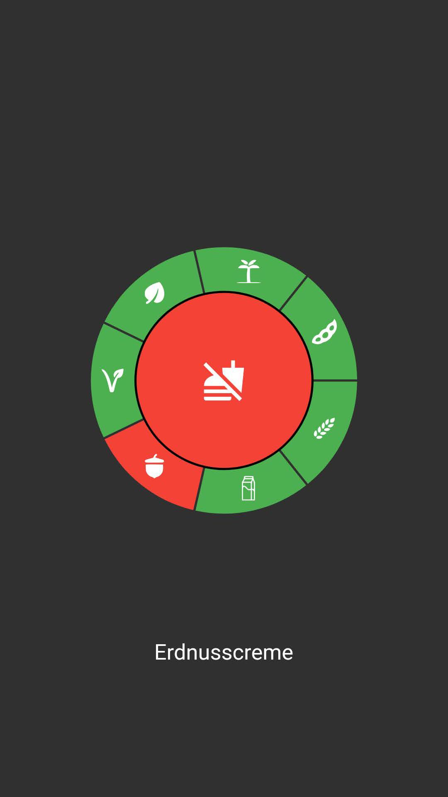

# PickyPal
Welcome to the PickyPal GitHub repo!

PickyPal is a convenient and easy-to-use food scanning app that allows you to scan any barcode and instantly see if the product is suitable for your dietary needs. Whether you have allergies to gluten, nuts, soy, or lactose, or you follow a vegetarian, vegan, or palm-oil-free diet, PickyPal has got you covered.

## Screenshots
     


## Getting Started
To get started, simply clone the repo and follow the instructions in the README file. We recommend using the latest version of Android Studio to build and run the app.

## Contributions
We're always working to improve the app and make it more useful for our users, so we welcome contributions from the community. If you're interested in contributing to the project, please follow the standard Git workflow:

1. Fork the repo
2. Create a new branch for your changes
3. Make your changes and commit them
4. Push your changes to your fork
5. Create a pull request to the main repo

## Issues
If you encounter any issues or have any questions, please don't hesitate to open an issue on the repo. We're always happy to help and appreciate any feedback that can help us improve the app.


## Add a new food preference
### Generate icon

1. Visit (https://icons8.com/)[https://icons8.com/]
    * Search for the icon you want to use
    * Download it and convert it so (svg)[https://convertio.co/png-svg/]
    * Make sure to rename the file to `{food_preference}.svg`
    * Add the file to the `assets/images/foodIcons/png` and `assets/images/foodIcons/svg` folders
2. Turn the svgs into a font
    * Visit (https://www.fluttericon.com/)[https://www.fluttericon.com/] and upload the svg files
    * Download the font and add the ttf to lib/assets/fonts/ as FoodIcons.ttf
    * Add the font to pubspec.yaml
        ```yaml
        flutter:
          fonts:
            - family: FoodIcons
              fonts:
                - asset: lib/assets/fonts/FoodIcons.ttf
        ```
    * Replace the food_icons.dart file with the one generated by fluttericon
3. Add the icon to the app
4. Add the parameters to FoodPreference.dart
   * Add a new factory method to FoodPreference.dart
   * Add a new bool or enum YESMAYBENO to the FoodPreference class
5. Add the food preference to the settings and UserPreferences
   * Add the food preference to the settings page
   * Add the food preference to the UserPreferences class
6. Add the food preference to the product
    * Add the food preference to the Product class
    * Search for the food preference in (https://world.openfoodfacts.org/api/v2/product/{product})[https://world.openfoodfacts.org/api/v2/product/4088700093214] and get the right tags 
7. Add the language strings
   * Add the food preference to the language strings in "lib/assets/languages/app_en.arb"
   * Add the food preference to the language strings in "lib/assets/languages/app_de.arb"
   * Run `flutter gen-l10n` to generate the new language strings
   * Check "lib/assets/languages/untranslated.txt" for missing translations


